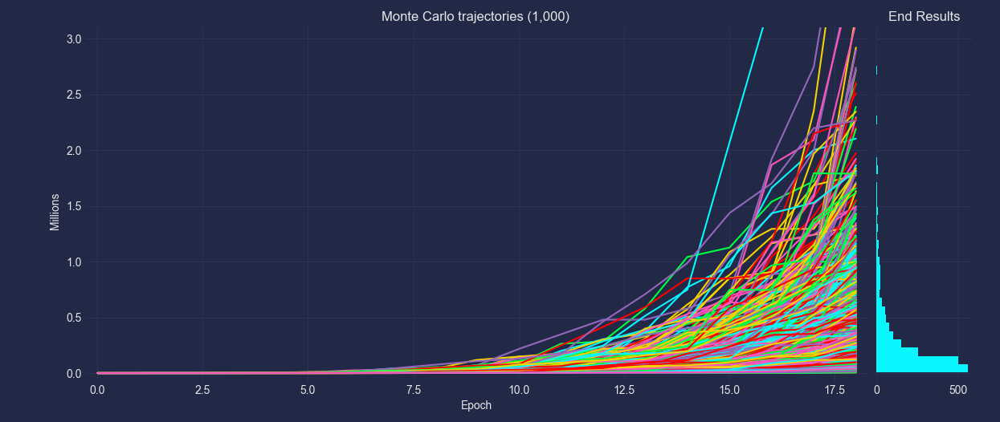
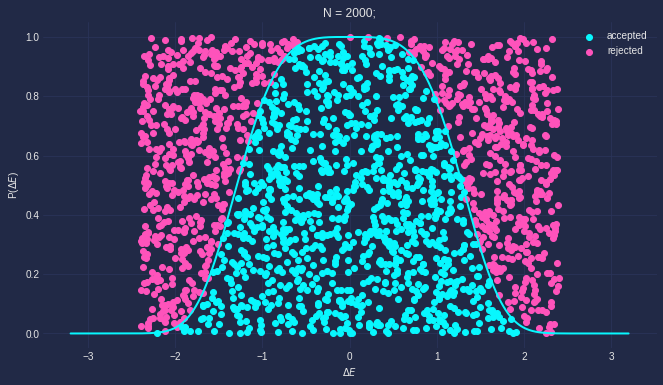

<!--  -->
#### [Website](https://adryanGL.vercel.app) 
<!-- #### Dressed by [DALL-E 2](https://openai.com/product/dall-e-2) -->
#### Self portrait made with [Voxelmap](https://voxelmap.readthedocs.io/en/latest/index.html) using a [3-D reconstruction protocol](https://voxelmap.readthedocs.io/en/latest/examples/meshrec.html)

[![Check out my stats](https://metrics.lecoq.io/andrewrgarcia?template=classic&isocalendar=1&habits=1&introduction=1&repositories=1&notable=1&languages=1&base=header%2C%20activity%2C%20community%2C%20repositories%2C%20metadata&base.indepth=false&base.hireable=false&base.skip=false&repositories.batch=100&repositories.forks=false&repositories.affiliations=owner&isocalendar=false&isocalendar.duration=half-year&languages=false&languages.ignored=open%20edge%20abl&languages.limit=8&languages.threshold=0%25&languages.other=false&languages.colors=github&languages.sections=most-used&languages.indepth=false&languages.analysis.timeout=15&languages.analysis.timeout.repositories=7.5&languages.categories=markup%2C%20programming&languages.recent.categories=markup%2C%20programming&languages.recent.load=300&languages.recent.days=14&habits=false&habits.from=200&habits.days=14&habits.facts=true&habits.charts=false&habits.charts.type=classic&habits.trim=false&habits.languages.limit=8&habits.languages.threshold=0%25&repositories=false&repositories.pinned=0&repositories.starred=2&repositories.random=2&repositories.order=featured%2C%20pinned%2C%20starred%2C%20random&notable=false&notable.from=organization&notable.repositories=false&notable.indepth=false&notable.types=commit&notable.self=false&introduction=false&introduction.title=true&config.timezone=America%2FNYC&config.twemoji=true&config.octicon=true)](https://metrics.lecoq.io/insights/andrewrgarcia)

<!-- ### Hi there 👋

I am an engineer with academic research experience and a strong computer background. I have substantial experience in Monte Carlo simulations, the application of machine learning &/ computer vision to stochastic problems, and in materials modeling. 

- 💬 Ask me about entropy, artificial intelligence, cloud computing, and my pinned Github repositories.

- 🌱 I’m currently learning Unity 

- 👯 I’m looking to collaborate on C++ and Python projects, indie software projects, new open-source game engines

Main programming languages :

    

Frameworks:

     

Machine Learning: 
  

MERN Stack: 

  -->

<!-- 
Social:

 -->

<!--

My area of expertise is in discrete stochastic simulations of crystals, and applications thereof to mathematical manipulation and machine learning algorithms. 

I have been expanding my graphics experience to more general representations of 3D solids, and have been applying my knowledge to code new algorithms using efficient programming languages such as Python and C++. 

**andrewrgarcia/andrewrgarcia** is a ✨ _special_ ✨ repository because its `README.md` (this file) appears on your GitHub profile.

Here are some ideas to get you started:

- 🔭 I’m currently working on ...

- 🌱 I’m currently learning ...

- 👯 I’m looking to collaborate on ...

- 🤔 I’m looking for help with ...

- 💬 Ask me about ..

- 📫 How to reach me: ...

- 😄 Pronouns: ...

- ⚡ Fun fact: ...
-->

<!--<a href="https://torus3d.herokuapp.com/">*Github profile image is a torus knot</a>  🍩🪢 -->

