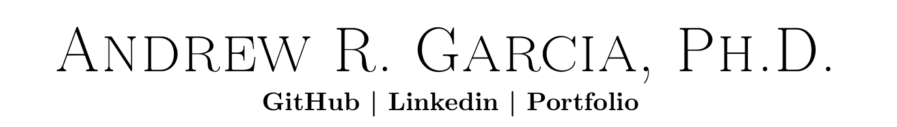

### Hi there 👋

I am a Ph.D. alumnus from [Dr. Ziegler's lab](https://ziegler.che.ufl.edu/) at the **University of Florida Department of Chemical Engineering**. 
I have been implementing higher-order tensors to model crystal structures and crystallization thereof through stochastic simulations. I have also used artificial intelligence to obtain meaningful information from these tensor representations, as well as used my knowledge on such to expand the field on structure-function relations. 

- 💬 Ask me about crystal growth, entropy, artificial intelligence, and cloud computing. 
- :mailbox:How to reach me: 

 

<!--
**andrewrgarcia/andrewrgarcia** is a ✨ _special_ ✨ repository because its `README.md` (this file) appears on your GitHub profile.

Here are some ideas to get you started:

- 🔭 I’m currently working on ...

- 🌱 I’m currently learning ...

- 👯 I’m looking to collaborate on ...

- 🤔 I’m looking for help with ...

- 💬 Ask me about ..

- 📫 How to reach me: ...

- 😄 Pronouns: ...

- ⚡ Fun fact: ...
-->

<!--<a href="https://torus3d.herokuapp.com/">*Github profile image is a torus knot</a>  🍩🪢 -->
